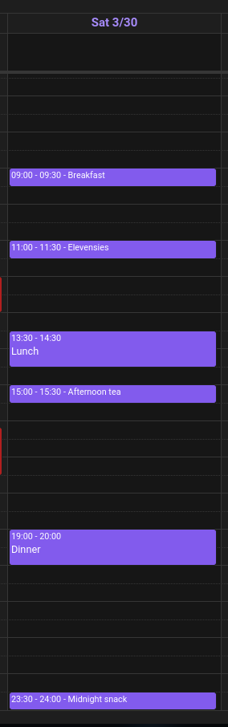
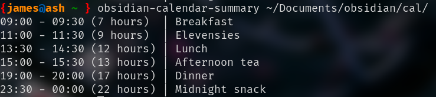

# obsidian-calendar-notify

Program to read files generated by [Obsidian Full Calendar](https://davish.github.io/obsidian-full-calendar/) and outputs the remaining events today.

`obsidian-calendar-notify` is designed to be lightweight and only depends on `chrono`, and implements a custom bare-bones yaml parser in order to be very responsive (unlike certain yaml parsers on crates.io...). This does mean that you can probably create a valid calendar file which does not get parsed correctly, however every autogenerated file should work fine. In the future this should be amended.

## Usage

`obsidian-calendar-notify <path(s) to directory containing calendar notes>`

Currently only supports the mode of Obsidian Full Calendar that stores each event in its own note.

## Example

The following day in Obsidian Full Calendar produces this output using `obsidian-calendar-summary`:

I like to add `obsidian-calendar-summary` to the end of my `.bashrc` along with [todo week all](https://github.com/Jachdich/todo-rs) to show my events today and my deadlines this week at the top of each terminal.

## Todo

- [ ] Allow custom time range
- [ ] Support multiple calendar sources
- [ ] Improve formatting & allow custom formatting
- [ ] Make the basic yaml parser more robust